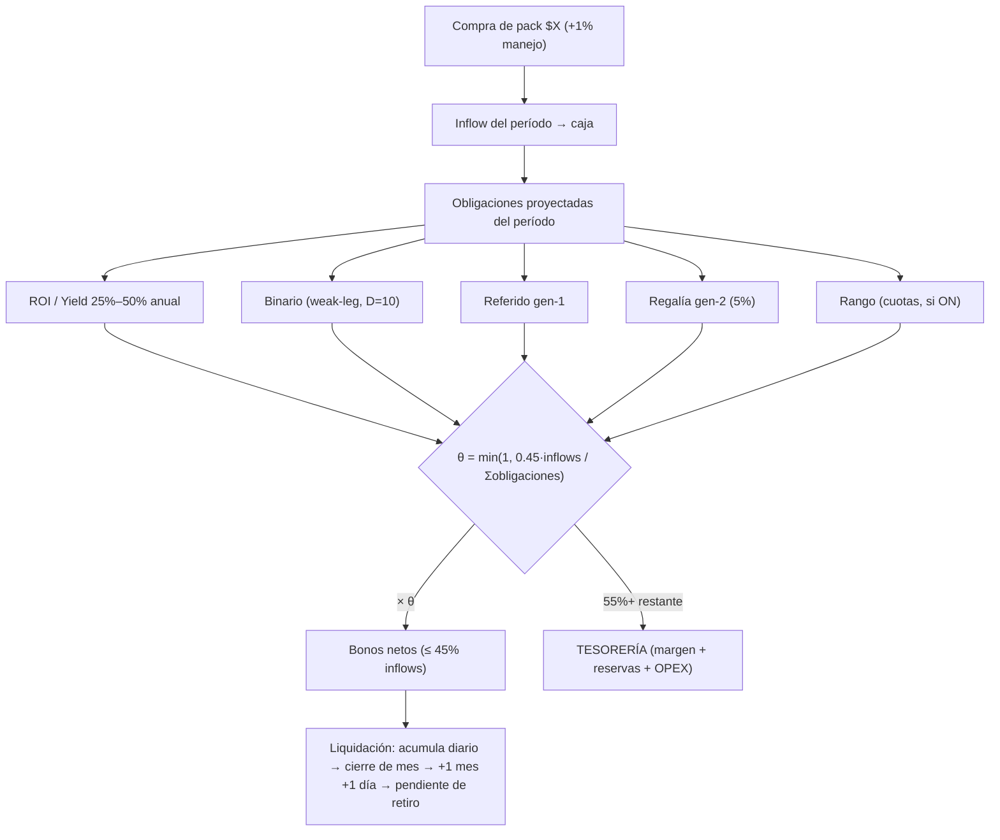
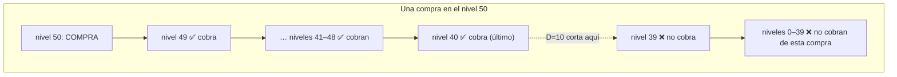
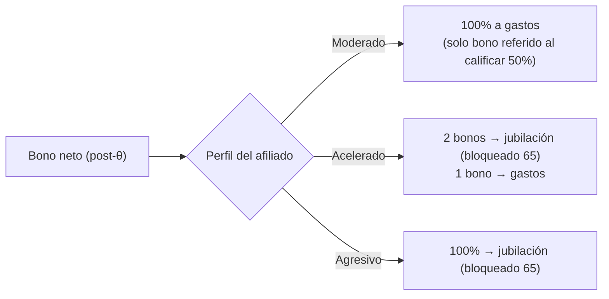
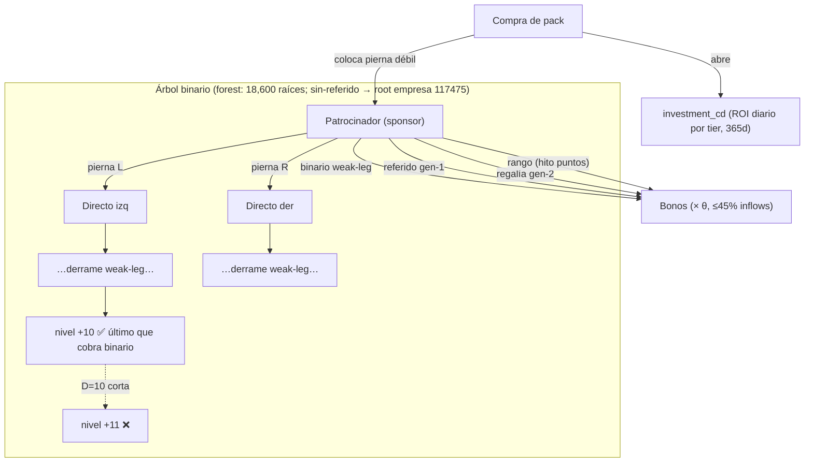

# Distribución de comisiones — Mindbliss Power v2

> Resumen ejecutable del contrato económico. Las decisiones vinculantes viven en
> ADR-0012 (invariantes T1–T4, θ) y ADR-0013→0018 (streams v2). Este doc es el
> mapa de "a dónde va cada dólar" + diagramas. Si un número aquí contradice el
> `plan_config` activo en DB, **manda el `plan_config`** (es prospectivo y se
> cambia con four-eyes, ADR-0010).

## 1. El sello maestro: θ (nunca se paga de más)

Todo bono, sin excepción, pasa por θ **antes** de emitirse:

```
θ = clamp( α × inflows(período) / Σ pagos_proyectados(período) , 0 , 1 )
con α = TreasuryAlpha = 0.45
```

- Si las obligaciones del período caben en el 45% de los inflows → **θ = 1** (todos cobran completo).
- Si se pasan → **θ < 1** y *todos* los pagos se prorratean parejo. El afiliado VE θ en su panel (línea roja #2: no se oculta).
- Consecuencia: **los bonos jamás superan el 45% de lo que entró**. La empresa no puede quebrar por el árbol, por construcción. Esto es independiente de qué tan profundo o ancho sea el bosque.



## 2. Los streams y sus tasas (PlanConfig real)

| Stream | Quién cobra | Tasa | Gate / condición | Alcance | Candado extra |
|---|---|---|---|---|---|
| **ROI / Yield** | dueño del pack | 25% anual base (→ tiers) | 1 directo ACTIVO por pierna, re-verificado cada período | propio | CD: principal bloqueado 365d (`CapitalLockPeriods`) |
| **Binario** | ancestros weak-leg | `BonusPerBlock` $10 / bloque de 500 pts · fundador `FounderBinaryMatchedRate` 10% | volumen en pierna débil | **D = 10 niveles** (`DepthCap`) | T3 cap diario 3× rango |
| **Referido g1** | patrocinador directo | fundador 10% (`FounderReferralRate`) / no-fundador `ReferralRate` | 1 directo activo a cada lado (`sponsor_gate`) | gen-1 | entra a θ |
| **Regalía g2** | patrocinador del patrocinador | 5% (`RoyaltyRate`) | g2 activo | gen-2 | T1 sólo |
| **Rango** | afiliado que cruza hito | bono fijo por rango, en N cuotas | puntos-por-pierna | T1 | Mitigación B (cuotas × θ) |

ROI por tiers (propuesta — califica con **2 directos de la misma inversión**):

| Pack (USD) | ROI base | ROI calificado |
|---|---|---|
| 100 / 250 / 500 | 25% | 30% |
| 1,000 / 2,500 | 25% | 35% |
| 5,000 / 10,000 | 25% | 40% |
| 25,000 | 25% | 45% |
| 50,000 | 25% | 50% |

## 3. Profundidad: por qué un bosque de 30+ niveles es estable

El binario **solo propaga 10 niveles hacia arriba** (`DepthCap = 10`). El árbol puede
medir 191 niveles estructuralmente; el dinero solo sube 10. Esto acota la cascada
de pago de cualquier compra sin partir el bosque.



> **Decisión:** se acota con `DepthCap=10` sobre el flujo de comisión, **no** re-enraizando
> el bosque. Re-enraizar rompe genealogía y derrame (el spillover desciende por la pierna
> débil) sin ningún beneficio financiero que el cap de profundidad no dé ya.
> El "breakage" de los niveles que no cobran es precisamente lo que crea el margen.

## 4. Híbrido tipo 401k: a dónde va el bono NETO

θ y los caps definen *cuánto* se paga. El perfil 401k define *dónde cae* ese neto
(no cambia el costo para la empresa; el modo Agresivo además mejora la caja porque
encierra el dinero hasta los 65).



**Plan de jubilación (CD permanencia):** principal aparece pero inmóvil; solo el ROI
diario acumula. No se puede sacar/mover/reinvertir hasta 365 días (inversión) o hasta
los 65 años (permanencia). Préstamo permitido sobre la ganancia. Retiro anticipado =
penalidad del 10% del monto retirado.

## 5. Candados (locks) end-to-end

1. **Registro + KYC** → dos perfiles: inversionista pasivo / red.
2. **Compra de pack** → colocación en el árbol (sin referido → root de empresa, id 117475).
3. **θ (T1)** → bonos ≤ 45% inflows, prorrateo visible.
4. **T2** → Σ bonos por paquete ≤ 2× monto; al tope, el paquete cierra.
5. **T3** → cap diario por usuario = 3× bono de rango.
6. **D = 10** → el binario no paga más de 10 niveles arriba.
7. **Liquidación** → diario acumula, cierre de mes, +1 mes +1 día al pendiente.
8. **CD 365d** / **permanencia 65 años** → float de tesorería.
9. **Superávit / sobrante / bonos no reclamados** → **Tesorería**.
10. **Fundadores v2.0** (registran + compran en v2) → 10% referido + 10% binario.
11. **Rango líder eliminado; T3 (tercera generación legacy) madura en v2 y ya no existe.**

## 6. Carrera de rangos (14 niveles)

Bono **fijo de una sola vez** al cruzar el hito de puntos en la **pierna débil** (T1: paga
una vez por afiliado y rango). Pagado en cuotas (Mitigación B) × θ del período. Valores
reales de `mlm.rank` (RDS):

| # | Rango | Puntos pierna débil | Bono (USD) |
|---|---|---:|---:|
| 1 | Bronce | 1,000 | $100 |
| 2 | Plata | 2,500 | $200 |
| 3 | Oro | 5,000 | $500 |
| 4 | Platino | 10,000 | $750 |
| 5 | Zafiro | 25,000 | $1,000 |
| 6 | Rubí | 50,000 | $2,500 |
| 7 | Esmeralda | 100,000 | $5,000 |
| 8 | Diamante | 250,000 | $10,000 |
| 9 | Diamante Azul | 500,000 | $15,000 |
| 10 | Diamante Negro | 750,000 | $20,000 |
| 11 | Embajador | 1,000,000 | $25,000 |
| 12 | Corona | 5,000,000 | $50,000 |
| 13 | Royal | 10,000,000 | $75,000 |
| 14 | King | 25,000,000 | $100,000 |

Total exposición si un afiliado alcanza los 14 ≈ **$305,050**. El "rango líder" del
sistema legacy se eliminó; la 3ª generación (T3 legacy) madura en la migración y no
existe en v2.

## 7. Estructura del árbol y dónde cae cada comisión



Reglas de colocación y cobro:
- **Colocación:** pierna débil (menor PV; desempate por conteo, luego L) descendiendo hasta el primer hueco (derrame/spillover). Sin `?ref` → root de empresa `117475`.
- **Binario:** sube por la pierna débil hasta **10 niveles** (`DepthCap`); más arriba no cobra de esa compra (breakage = margen).
- **ROI/CD:** propio del comprador, diario por tier, bloqueado 365d (no sube el árbol).
- **Referido gen-1 / Regalía gen-2 / Rango:** al patrocinador / patrocinador-del-patrocinador / al que cruza el hito.
- **θ** sella todo: ningún período paga más de `α=45%` de inflows.

## 8. Lock de solvencia al editar comisiones (four-eyes)

Cambiar `plan_config` (admin propone → 2º admin aprueba) corre una **simulación de θ**
antes de publicar; si θ proyectado **< 0.85** el publish se **bloquea**:

```
θ_sim = clamp( α_propuesto × inflows_30d / (ROI_CDs_30d + inflows_30d×(referido+regalía)) , 0, 1 )
```

(aproximación del modelo "CD para todos"; el θ canónico del cierre binario aplica cuando ese
motor corra). Endpoint `POST /api/admin/plan/simulate` da el preview en el panel.

## 9. Pendiente de validar contra DB / simulador
- Correr el simulador en **estado estacionario (growth = 0)** para confirmar margen ≥ 55% (línea roja #7: si necesita reclutar para pagar, es Ponzi).
- Lock de simulación con el **θ canónico** del cierre binario (hoy es la proyección forward del modelo CD).
